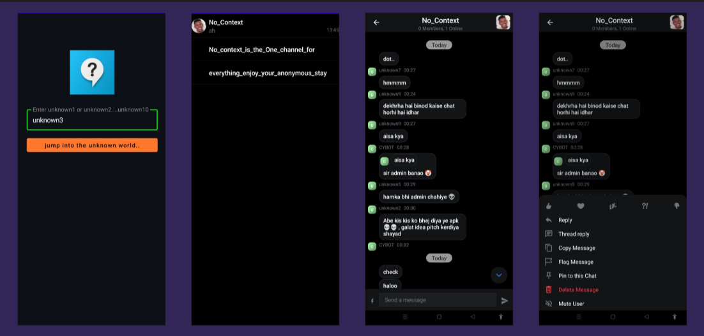

# No_Context
### Problem statement:
Let's just say we were getting bore of the non chaotic,soo official rules and regulation of alreay existing chat applications, every-one knowing who you are behind the
screen and you just can't have some fun without caring about what other will think, thats the reason we created this application , for you to play around in this anonymous
world

### Proposed Solution:
No_Context is an fun application that can get rid of all the problems mentioned above, This is a chat application with only one chat channel and everyone is anonymous 
as the names are only yours till you exit the app then you can change again, the names you can chose hard-coded to make this more fun, type unknown1 , unknown2 and so on till
unknown10. our application is a perfect recipe for chaos.

### Application images:

### Functionality & Concepts used:
The app is very user friendly, chose your unknown number , login , go to No_context channel and you are ready for a fun chat with everyone.
Live-Data is being used to keep the track of the onging chat
Intents are used for navigating among different activities of the application
channel and Chat's theme will change with the systems theme (light/dark)

